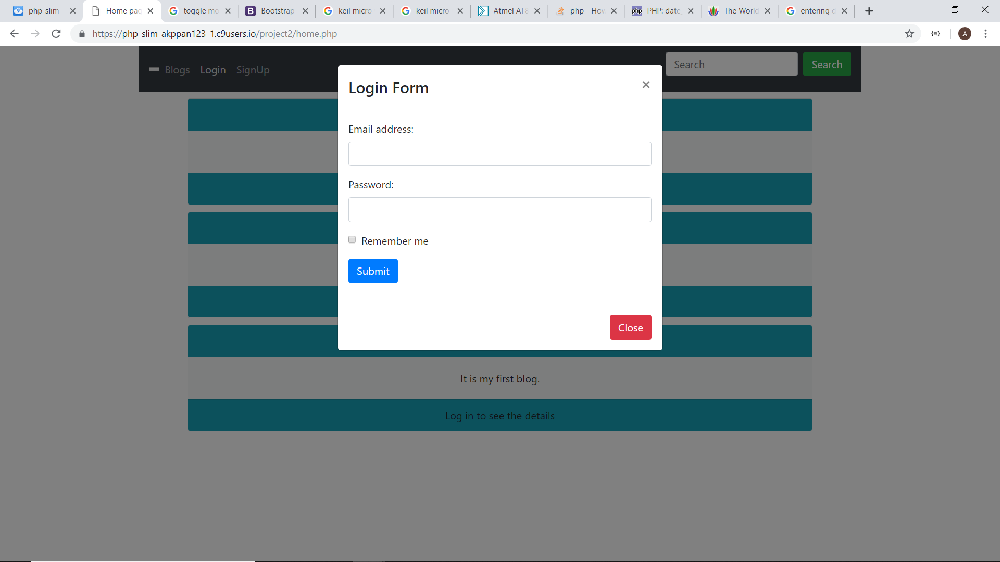
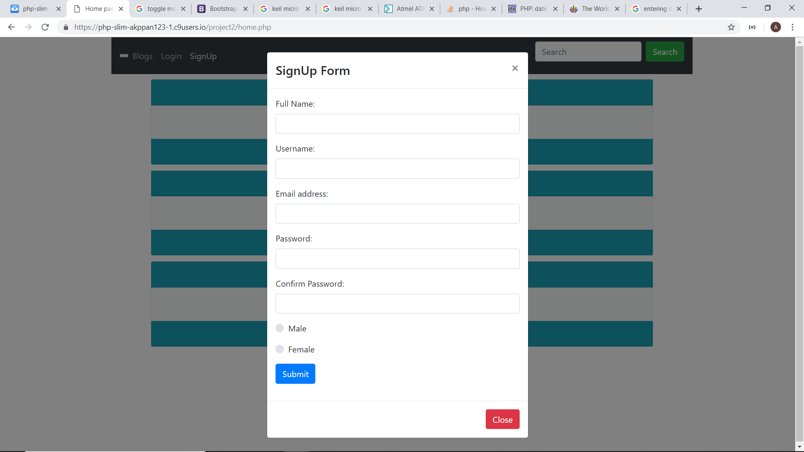
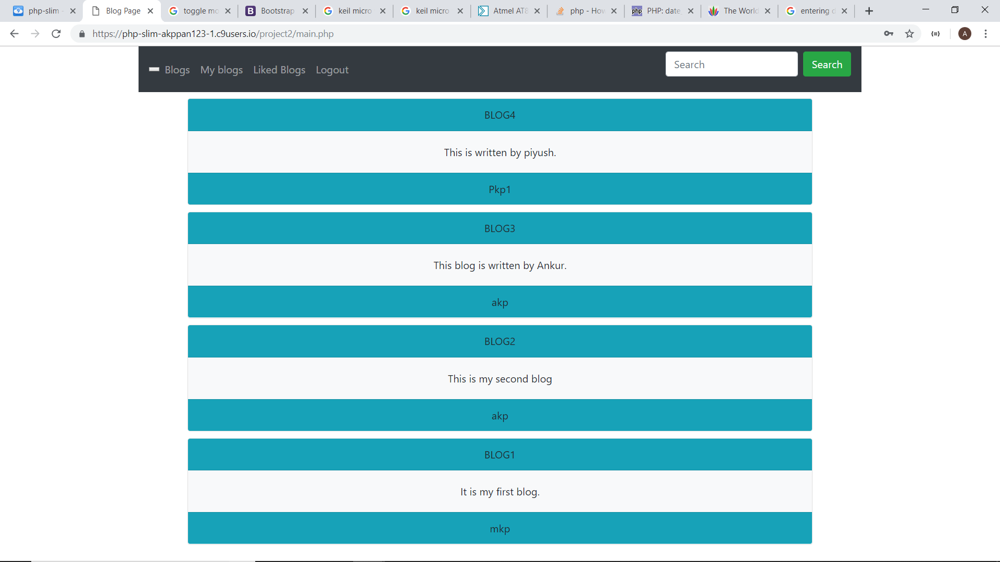
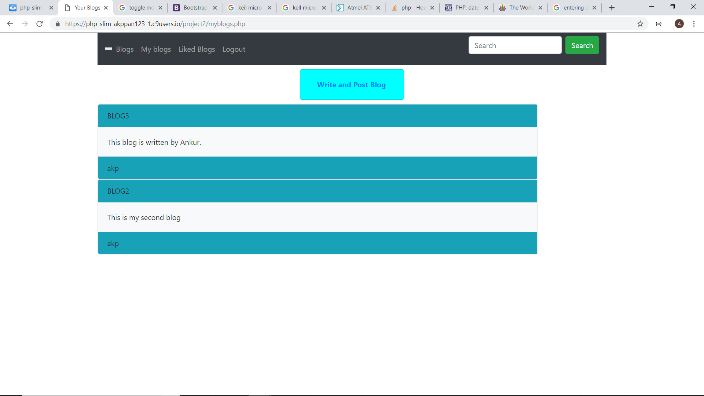

# BlogSpot

This blogsite uses HTML, CSS, Bootstrap, JavaScript and PHP.

For Bootstrap, its documentation is from https://getbootstrap.com/docs/4.0/getting-started/introduction/

For database connection PDO is used in this project.

The documentation was used from https://phpdelusions.net/pdo

For php its official site is https://www.php.net/

### This is the homepage

### This is the login page

### This is the signup page

### This page shows the username and all their blogs

### Here you can see your blogs and add more

